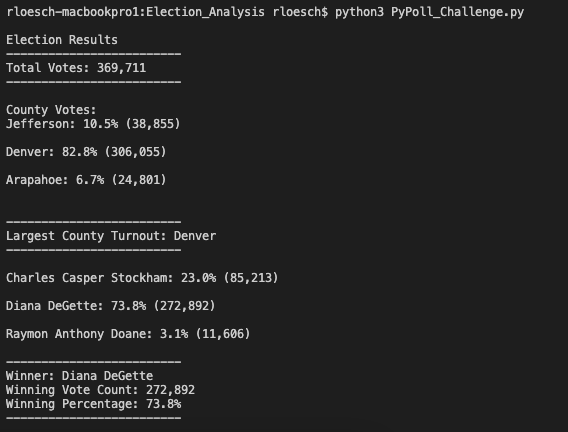

# Election_Analysis

## Overview of Election Audit
This section explains the purpose of this election audit analysis.

A Colorado Board of Elections employee has given you the following tasks to complete the election audit of a recent local congressional election:

The data we need to retrieve is as follows:
1. The total number of votes cast
2. A complete list of candidates who received votes
3. The percentage of votes each candidate won
4. The total number of votes each candidate won
5. The winner of the election based on popular vote
6. The voter turnout for each county
7. The percentage of votes from each county out of the total count
8. The county with the highest turnout

## Resources
- Data Source: [election_results.csv](Resources/election_results.csv)
- Software: Python 3, Visual Studio Code

## Election-Audit Results
The following section contains a list of the election outcomes. 

Running the Python 3 program from the command line provides us with a summary of the audit results as shown in the output that follows.  The same output is also available in the [output file](analysis/election_results.txt) 

The analysis of the election show that:
- There were 369,711 votes cast in the congressional election.

- The candidates were:
    - Charles Casper Stockham
    - Diana DeGette
    - Raymon Anthony Doan

- The counties included in the election were:
    - Jefferson
    - Denver
    - Arapahoe

- The county results were:
    - Jefferson county had 10.5% of the votes and 38,855 votes.
    - Denver county had 82.8% of the votes and 306,055 votes.
    - Arapahoe county had 6.7% of the votes and 24,801 votes.

- The county with the largest turnout was Denver with 306,055 votes

- The candidates results were:
    - Candidate Charles Casper Stockham received 23.0% of the votes and 85,213 votes.
    - Candidate Diana DeGette received 73.8% of the votes and 272,892 votes.
    - Candidate Raymon Anthony Doane received 3.1% of the votes and 11,606 votes.

- The winner of the election was:
    - Candidate Diana DeGette, who received 73.8% of the vote and 272,892 votes.

## Election-Audit Summary
In a summary statement, provide a business proposal to the election commission on how this script can be used—with some modifications—for any election. Give at least two examples of how this script can be modified to be used for other elections.

